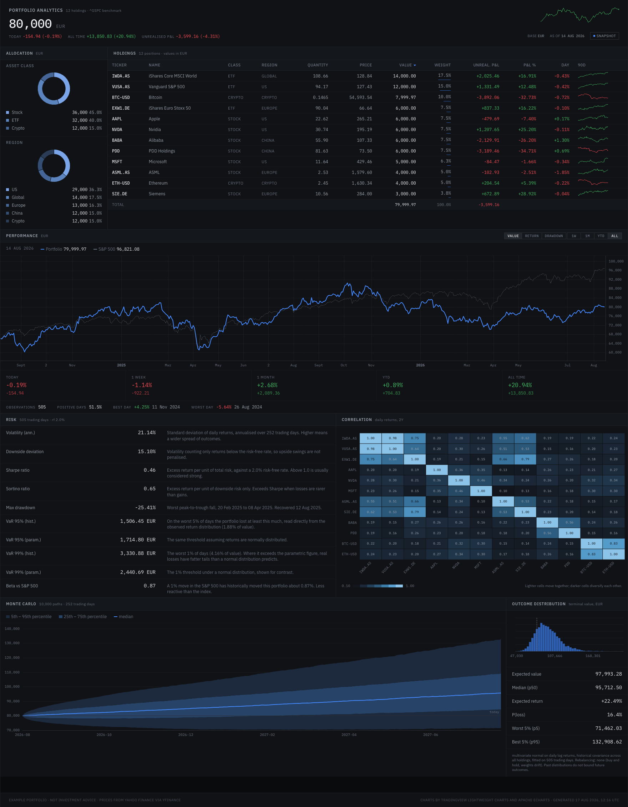

# Portfolio Analytics Dashboard

A portfolio analytics application: a Python backend that computes allocation,
performance, risk and Monte Carlo metrics from real market data, and a React
dashboard that presents them as a dense, institutional-style terminal.



> **The portfolio is an example, not a real net worth.** `backend/holdings.json`
> defines a demonstration portfolio of roughly €80,000 across twelve
> instruments. The *prices, returns and every derived metric are real* — pulled
> from Yahoo Finance — but the positions are invented for demonstration.
> Nothing here is investment advice.

---

## Contents

- [Quick start](#quick-start)
- [Data sources](#data-sources)
- [Editing the portfolio](#editing-the-portfolio)
- [How the numbers are computed](#how-the-numbers-are-computed)
  - [FX handling](#fx-handling)
  - [Calendar alignment](#calendar-alignment)
  - [Cost basis and P&L](#cost-basis-and-pl)
  - [Monte Carlo method](#monte-carlo-method)
- [Design decisions](#design-decisions)
- [Project layout](#project-layout)
- [Testing](#testing)
- [Limitations](#limitations)

---

## Quick start

Requires **Python 3.11+** and **Node 18+**.

### 1. Backend

```bash
python3.11 -m venv .venv
source .venv/bin/activate
pip install -r backend/requirements.txt

cd backend
python generate_snapshot.py       # fetch prices, compute everything, write ../snapshot.json
uvicorn api:app --reload --port 8000
```

The API is then at `http://localhost:8000` (OpenAPI docs at `/docs`).

### 2. Frontend

```bash
cd frontend
npm install
npm run dev                       # http://localhost:5173
```

The dashboard reads the committed `snapshot.json` by default, so **it runs with
no backend process at all**. To point it at the live API instead, append
`?source=api` to the URL, or set it permanently — see below.

---

## Data sources

The frontend reads from either source through one configurable base URL, and no
component knows which is in use — both resolve to the same `Analytics` shape in
`src/lib/api.ts`.

| Source | When | How |
|---|---|---|
| `snapshot` (default) | No backend needed; what the committed demo uses | Fetches `snapshot.json` |
| `api` | Live, refetchable data | Fetches the seven FastAPI endpoints in parallel |

Resolution order:

1. `?source=api` or `?source=snapshot` in the URL
2. `frontend/.env`:
   ```ini
   VITE_DATA_SOURCE=api
   VITE_API_BASE_URL=http://localhost:8000
   ```
3. Defaults: `snapshot`, `http://localhost:8000`

The top bar always shows which source is active.

Prices are cached to `backend/.cache/` (git-ignored) for 12 hours, so repeated
runs do not refetch. Force a refresh with `python generate_snapshot.py
--no-cache` or `POST /refresh`.

---

## Editing the portfolio

Edit `backend/holdings.json` and regenerate:

```jsonc
{
  "base_currency": "EUR",
  "holdings": [
    {
      "ticker": "IWDA.AS",              // yfinance symbol
      "name": "iShares Core MSCI World",
      "asset_class": "ETF",             // ETF | Stock | Crypto (free text; drives grouping)
      "region": "Global",               // null for region-less assets (crypto)
      "currency": "EUR",                // EUR or USD
      "quantity": 108.661909,           // fractional units allowed
      "cost_basis_per_unit": 110.2,     // in the instrument's own currency
      "acquired": "2025-11-14"          // sets the FX rate applied to the cost basis
    }
  ]
}
```

```bash
cd backend && python generate_snapshot.py
```

Adding a currency other than EUR/USD requires extending the conversion in
`data.py::load_market_data`, which currently raises on unknown currencies rather
than silently mispricing them.

Risk conventions (risk-free rate, benchmark, lookback, VaR confidences,
simulation size and seed) all live in `backend/config.py`.

### How the demo positions were built

Quantities were sized so each position matched a target EUR value at the close
of 2026-08-14, then frozen. Cost bases are the instrument's **actual closing
price** on the `acquired` date, with entry dates spread across the preceding
four to fourteen months. That yields a believable mix — six winners, six losers,
about -4.3% overall — rather than a portfolio that is implausibly all green.

---

## How the numbers are computed

Every metric is computed from the holdings and real price history. No figure in
the UI is hard-coded. `backend/metrics.py` states the formula for each one in
its docstring; `API.md` tabulates them.

### FX handling

The base currency is EUR, but seven of the twelve instruments are quoted in USD.

`EURUSD=X` is quoted as **USD per 1 EUR**, so a USD price converts as
`price_eur = price_usd / eurusd`.

The daily FX series is applied across the **whole history**, not just today, so
the equity curve reflects both asset performance and currency movement — the
honest view for a EUR-based investor. A US position can lose value in EUR terms
on a day when it rose in USD.

### Calendar alignment

Crypto trades seven days a week; listed equities do not. Mixing them naively
either inflates the observation count — breaking the `sqrt(252)` annualisation
convention — or injects artificial zero-return days that understate volatility.

The benchmark's trading calendar (NYSE, via `^GSPC`) is therefore the master
index:

- Crypto observations on non-trading days are **dropped**.
- Instrument-specific gaps (Euronext closed while NYSE is open) are
  **forward-filled** from the last close.
- Leading rows that are still incomplete are removed.

Every series then has exactly one observation per trading day, and `sqrt(252)`
annualisation is valid. The trade-off is explicit: a weekend crypto crash shows
up on the following Monday rather than as its own observation.

### Cost basis and P&L

`cost_basis_per_unit` is stored in the instrument's own currency and converted
to EUR at the FX rate **on the acquisition date**, not today's rate. Unrealised
P&L therefore includes the currency move since entry, which is what a EUR
investor actually experienced.

### Monte Carlo method

10,000 paths over 252 trading days, simulated across the **individual holdings**
rather than the portfolio aggregate — which keeps the diversification effect
intact.

1. Convert historical daily simple returns to log returns, `x = ln(1 + r)`.
2. Estimate the mean vector `mu` and covariance matrix `Sigma` of `x`.
3. Draw `x_t ~ N(mu, Sigma)` via a Cholesky factor (`x = mu + Lz`), reproducing
   the historical correlation structure.
4. Compound each asset (`v_i(t) = v_i(0) * exp(cumsum(x_i))`) and sum across
   assets.

**Why log returns:** compounding is exact and prices stay positive. Sampling
*simple* returns from a normal distribution can draw below -100%, implying a
negative price.

Paths are generated in batches (`mc_batch_paths`), so peak memory stays bounded
regardless of path count; only the aggregated portfolio paths are retained. A
singular or numerically indefinite covariance matrix is repaired by eigenvalue
clipping rather than crashing.

The seed is fixed (`config.mc_seed`), so the committed snapshot is reproducible.

**Assumptions, stated plainly:** buy and hold with no rebalancing, contributions,
fees or taxes; normally distributed log returns with constant parameters; and
the past two years taken as representative of the next one. Real markets have
fatter tails and time-varying volatility, so the extreme percentile bands are
optimistic. The dashboard prints these assumptions beneath the chart.

---

## Design decisions

The brief was an institutional finance tool — a Bloomberg terminal or a FINOS
internal tool — not a template. Concretely:

### Governing system: IBM Carbon

[Carbon](https://carbondesignsystem.com/) is the UX guideline. Its 2/4/8 spacing
scale, type scale and colour-token discipline are adopted directly in
`tokens.css`, which is why the density and rhythm read as enterprise software
rather than as arbitrary numbers. Carbon's Gray 100 dark theme informed the
surface ramp, and its status colours (`#42be65` green, `#fa4d56` red) are used
for semantic sign.

### Typography

**IBM Plex Sans** for UI text, **IBM Plex Mono for every number** — prices,
percentages, ratios, dates, axis labels, tooltips. Self-hosted via
`@fontsource`, bundled by Vite: no external font requests at runtime, no system
font stack, no `-apple-system`.

Numerals use `font-variant-numeric: tabular-nums` with `tnum` and `zero`
feature settings, so digits occupy identical widths and columns align exactly
down the grid — the property that makes a dense financial table scannable.

### Colour

Flat, solid tokens only. **No gradients anywhere**, no shadows, no elevation.

- A near-black page (`#0a0b0d`) with panels exactly one step lighter (`#101215`).
- Separation comes from **1px hairline rules**, never from floating cards.
- One accent (`#4589ff`), used for interaction and the primary data series.
- Semantic green/red apply **only to numbers and small markers**, never as
  decorative fills. A histogram bar is never coloured by profitability; the
  break-even point is marked with a reference line instead.
- The allocation donuts use a restrained steel ramp; the correlation heatmap
  uses a **single-hue sequential** ramp so magnitude is encoded by luminance
  alone. A rainbow scale would imply categories that do not exist.

### No cards

Panels have no border, no radius and no shadow. Every grid uses `gap: 1px` over
a `--line` background, so the gap itself *is* the rule — which guarantees each
separator is exactly one physical pixel. Two adjacent borders would render as
two.

### Libraries, and why

| Concern | Library | Why |
|---|---|---|
| Equity curve, returns, drawdown | [TradingView Lightweight Charts](https://github.com/tradingview/lightweight-charts) v5 | The professional standard for financial time series. Thin lines, hairline axes, magnet crosshair. Area *gradients* are its default look and are deliberately not used — only line series, matching the flat system. |
| Correlation heatmap, Monte Carlo fan, histogram, donuts | [Apache ECharts](https://echarts.apache.org/) v6 | Best-in-class heatmap and stacked-band support. Imported through `echarts/core` with only the five chart types and five components actually used, so tree shaking keeps the bundle to a fraction of the full library. |
| Holdings grid | [TanStack Table](https://tanstack.com/table) v9 | Headless — it supplies sorting and row models but zero styling, which is what a bespoke design system needs. Only the core and row-sorting features are registered. |
| Row sparklines | Hand-rolled inline SVG | At 84×18px a charting runtime would cost far more than the twenty lines of path maths it replaces, and twelve canvas instances inside a table would be wasteful. |

Both chart libraries read their colours from the **live CSS custom properties**
via `charts/theme.ts`, so `tokens.css` stays the single source of truth: change
a token and every chart follows. No palette is duplicated in JavaScript.

Chart attribution is given in the application footer and here, rather than as an
overlay mark inside the plot area.

### Layout

Top bar → allocation + holdings → performance → risk + correlation → Monte
Carlo. The shell collapses to a single column below 1240px, and the holdings
grid sheds its least load-bearing columns in priority order (name, then class
and quantity, then region and day change) rather than clipping or scrolling
sideways — so it stays clean cropped to a vertical screen recording.

---

## Project layout

```
├── backend/
│   ├── config.py            # every tunable: currency, benchmark, rf rate, MC size, seed
│   ├── data.py              # yfinance fetch, disk cache, FX conversion, calendar alignment
│   ├── metrics.py           # pure metric functions, each documenting its formula
│   ├── montecarlo.py        # batched correlated simulation
│   ├── portfolio.py         # assembly layer: the only module that knows the JSON contract
│   ├── serialize.py         # rounding + JSON-safety (no NaN/inf ever reaches the wire)
│   ├── api.py               # FastAPI routes, CORS, error boundary
│   ├── generate_snapshot.py # runs everything once, writes ../snapshot.json
│   ├── holdings.json        # the portfolio definition — edit this
│   └── tests/               # 78 tests, no network access
├── frontend/
│   └── src/
│       ├── styles/          # tokens.css (the design contract), base, layout, panels
│       ├── lib/             # types mirroring the API, data access, formatters
│       ├── charts/          # ECharts + Lightweight Charts wrappers, token bridge
│       └── components/      # one file per panel
├── snapshot.json            # committed: the frontend runs from this with no backend
└── API.md                   # every endpoint, with units and example JSON
```

The layering rule: `metrics.py` and `montecarlo.py` are pure and unrounded;
`portfolio.py` composes, rounds and shapes; `api.py` only routes. The wire
format can change without touching a single computation.

---

## Testing

```bash
cd backend && python -m pytest        # 78 tests
```

The suite is hermetic — it never touches the network. A synthetic portfolio and
price history stand in for Yahoo Finance.

- `test_metrics.py` pins each metric against a hand-computable input, so a
  refactor that silently changes a formula fails here rather than in the UI.
- `test_montecarlo.py` asserts the properties a stochastic simulation must
  satisfy: determinism under a fixed seed, correctly ordered and widening
  percentile bands, a normalised histogram, preserved correlation structure,
  positive values, and recovery from a singular covariance matrix.
- `test_api.py` checks the JSON contract itself — allocations summing to 1,
  per-holding series summing to the equity curve, VaR rising with confidence,
  Monte Carlo bands aligning with their date array, and strict JSON-safety on
  every route.

Frontend typecheck and build:

```bash
cd frontend && npx tsc -b && npm run build
```

---

## Limitations

Worth knowing before reading anything into the output:

- **Yahoo Finance is the single data source.** It is free and occasionally
  wrong: adjusted closes get revised, and thin instruments can carry bad prints.
- **Two years of history** is a short window for volatility and correlation
  estimates, and it covers one particular regime.
- **Correlations are not stable.** The matrix is a historical average; in a
  sell-off, correlations tend toward 1 exactly when diversification is needed.
- **Monte Carlo assumes normal log returns** with constant parameters. Real
  markets have fatter tails and volatility clustering, so the p5/p95 bands are
  wider in reality than shown.
- **No fees, taxes, dividends-as-cash, contributions or rebalancing** are
  modelled. Prices are auto-adjusted, so dividends are reflected in the price
  series rather than as separate cash flows.
- **Beta is measured against the S&P 500 in USD** while the portfolio is valued
  in EUR, so the FX move is inside the portfolio's returns but not the
  benchmark's.
